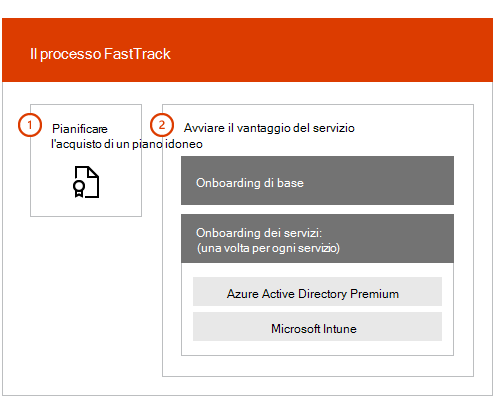

# Informazioni generali su FastTrack Center Benefit

> [!CAUTION]
> Il contenuto non è più attuale ed è stata pianificata la rimozione. Usare il sommario nel riquadro di spostamento a sinistra per il contenuto attuale.

Con FastTrack Center Benefit per Microsoft Azure Active Directory Premium, Microsoft Intune e Azure Information Protection, è possibile collaborare da remoto con gli esperti di FastTrack per avere l’ambiente pronto per l’utilizzo e per pianificare l’implementazione e l’utilizzo nell’organizzazione. Per maggiori informazioni sull’idoneità, vedere [FastTrack Center Benefit Process per Enterprise Mobility + Security (EMS)](EMS-fasttrack-process.md).

Il processo di onboarding presenta due componenti principali:

-   **Onboarding di base**: si tratta di attività necessarie per la configurazione del tenant e l'integrazione con Azure Active Directory, se richiesta. L'onboarding di base fornisce, inoltre, la linea di base per l'onboarding di altri servizi idonei di Microsoft Online.

-   **Onboarding dei servizi**: si tratta di attività necessarie per configurare una qualsiasi delle varianti autonome del carico di lavoro EMS (Azure AD Premium, Intune e Azure Information Protection).

Il diagramma seguente descrive le fasi di onboarding di alto livello per il FastTrack Center Benefit.

Ecco come funziona il processo:

- Il FastTrack Center tenta di contattare l'utente per offrire assistenza di onboarding dopo l'acquisto di licenze di un servizio idoneo. È anche possibile richiedere assistenza dal [FastTrack Center](https://go.microsoft.com/fwlink/?linkid=780698), se si è pronti a distribuire questi servizi per l'organizzazione. Per richiedere assistenza, accedere al [FastTrack Center](https://go.microsoft.com/fwlink/?linkid=780698) con l'account aziendale o scolastico, andare alla dashboard, espandere il collegamento **Serve assistenza?** nell'angolo in basso a destra della pagina e quindi seguire le istruzioni visualizzate per completare la richiesta. Una volta iniziato l'onboarding, verrà impostata la pianificazione delle riunioni online.

-   Il team di FastTrack fornisce assistenza anzitutto sulle funzionalità principali, comuni per tutti i Microsoft Online Services, e quindi sull'onboarding di ogni servizio idoneo.

Tutte le indicazioni dell’onboarding vengono fornite in remoto dal personale di FastTrack assegnato:

-   Il team di FastTrack fornirà assistenza in remoto tramite varie attività di onboarding che utilizzano una combinazione di strumenti, documentazione e istruzioni.

-   Le indicazioni dell'onboarding vengono fornite dal FastTrack Center e sono disponibile durante il regolare orario lavorativo in base all'area.

-   L'assistenza per l’onboarding è disponibile in cinese tradizionale e cinese semplificato (le risorse parlano solo cinese mandarino), inglese, francese, tedesco, italiano, giapponese, coreano, portoghese (brasiliano), spagnolo, tailandese e vietnamita.

-   Il team di FastTrack può lavorare direttamente con l'utente o con il rappresentante.

> [!NOTE]
> **Per saperne di più** consultare [Enterprise Mobility + Security](https://www.microsoft.com/cloud-platform/enterprise-mobility).

## Passaggi successivi

[FastTrack Center benefit per EMS - Aspettative per l’ambiente di origine](EMS-source-environment-expectations.md)

