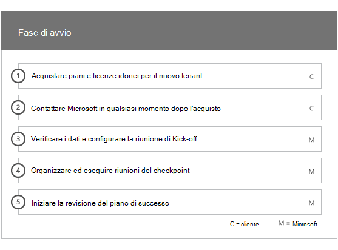
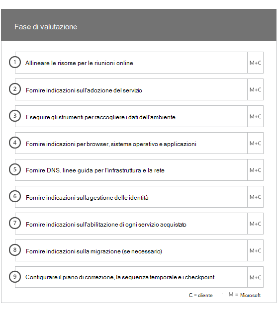
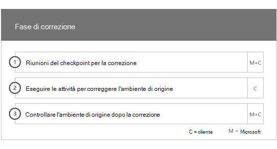
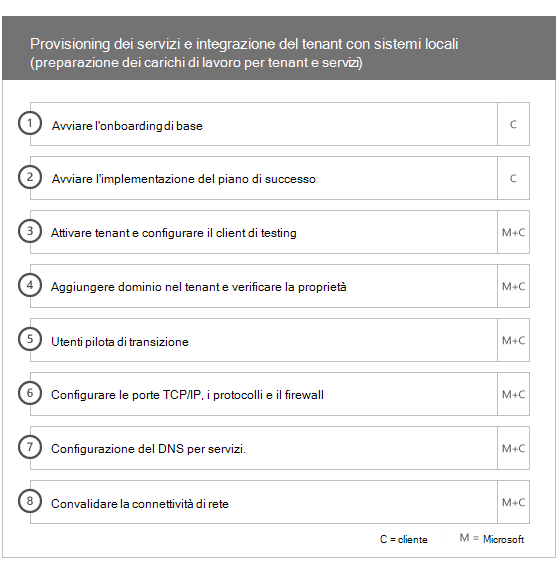
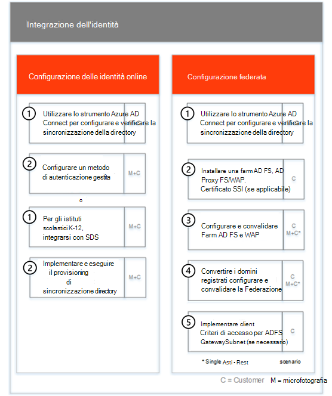
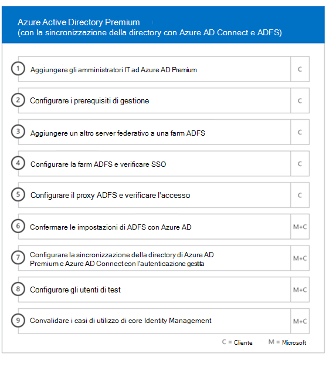
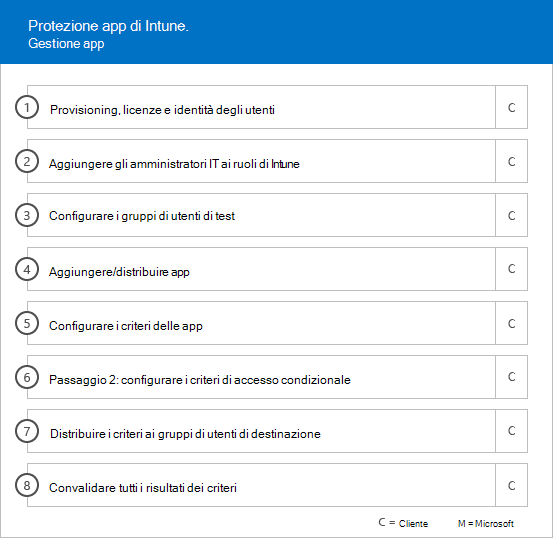
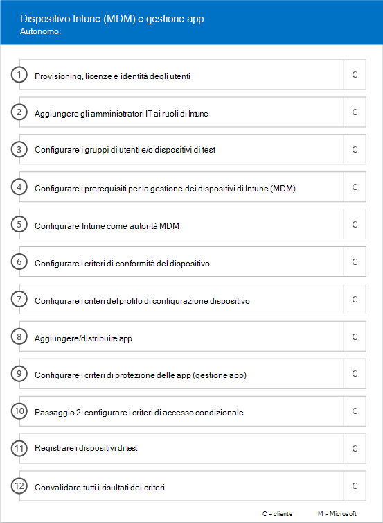

# Fasi di onboarding

Quando si utilizzano i [servizi idonei e si prevede](M365-eligible-services-and-plans.md) di ottenere Microsoft Azure Active Directory Premium, Microsoft Intune e Azure Information Protection pronte per l'uso, sono presenti diverse fasi del processo. Nelle sezioni seguenti vengono descritte tutte le fasi del processo di onboarding.

L'onboarding ha quattro fasi principali:

## Fase di avvio

Dopo aver acquistato il numero appropriato di licenze, seguire le istruzioni riportate nell'e-mail di conferma dell'acquisto per associare le licenze al tenant esistente o a un nuovo tenant. Microsoft verifica quindi la propria idoneità per il FastTrack Center benefit e cerca di contattare l'utente per offrire assistenza onboarding.

> [!NOTE]
> È inoltre possibile richiedere assistenza dal [centro FastTrack](https://go.microsoft.com/fwlink/?linkid=780698) se si è pronti a distribuire questi servizi per la propria organizzazione.

### Per richiedere assistenza

1. Accedere al [sito di FastTrack](https://go.microsoft.com/fwlink/?linkid=780698).
2. Selezionare **FastTrack**.
3. Selezionare **Servizi**.
4. Completare la **richiesta di assistenza con il modulo Microsoft 365**.

Dopo l'avvio del supporto per l'onboarding, verrà impostata una pianificazione delle riunioni online.

> [!NOTE]
> Se si dispone di un partner Microsoft elencato nel tenant di Office 365, questa opzione non viene visualizzata. Rivolgersi al proprio partner Microsoft per assistenza.

I partner Microsoft possono inoltre ottenere assistenza tramite il [sito FastTrack](https://go.microsoft.com/fwlink/?linkid=780698) per conto di un cliente. To do so:

1. Accedere al [sito di FastTrack](https://go.microsoft.com/fwlink/?linkid=780698).
2. Selezionare **FastTrack**.
3. Selezionare **Clienti personali**.
4. Cercare il cliente desiderato o selezionarlo nell'elenco di clienti.
5. Selezionare **Servizi**.
6. Completare la **richiesta di assistenza con il modulo Microsoft 365**.

Dopo l'avvio del supporto di onboarding, FastTrack configura una pianificazione di riunioni online con l'utente per discutere del processo di onboarding, verificare i dati e impostare una riunione di Kick-off.

## Fase di valutazione

Dopo l'inizio del processo di onboarding, il centro FastTrack collabora con l'utente per valutare l'ambiente di origine e i requisiti. Gli strumenti vengono eseguiti per valutare l'ambiente in uso e gli specialisti di FastTrack consentono di valutare la propria Active Directory locale, i browser Internet, i sistemi operativi dei dispositivi client, il sistema DNS (Domain Name System), la rete, l'infrastruttura e il sistema di identità per determinare se le modifiche sono necessarie per l'onboarding.

Il centro FastTrack inoltre vi collegherà con le indicazioni su come guidare l'adozione corretta dei servizi idonei.

In base alla configurazione corrente, viene fornito un piano di correzione che consente all'ambiente di origine di soddisfare i requisiti minimi per l'onboarding con esito positivo su EMS o sui singoli servizi cloud. È inoltre possibile configurare le chiamate di checkpoint appropriate per la fase di correzione.

## Fase di correzione
È possibile eseguire le attività del piano di correzione nell'ambiente di origine in modo da soddisfare i requisiti per l'onboarding e l'adozione di ogni servizio (in base alle esigenze).

Prima di iniziare la fase di attivazione, vengono verificati insieme i risultati delle attività di correzione per verificare che l'utente sia pronto a procedere.

## Fase di attivazione
Una volta completate tutte le attività di correzione, il progetto viene spostato sulla configurazione dell'infrastruttura di base per il consumo dei servizi e sul provisioning di ogni servizio cloud EMS idoneo.

**Abilitare le funzionalità di fase-Core**

L'onboarding di base prevede il provisioning di servizi e l'integrazione di identità e tenant. Sono inoltre disponibili passaggi per fornire una base per l'onboarding dei servizi online come Azure AD Premium, Intune e Azure Information Protection.

> [!NOTE]
> WAP è l'acronimo di Web Application Proxy. SSL è l'acronimo di Secure Sockets Layer. SDS è l'acronimo di School Data Sync. Per ulteriori informazioni su SDS, vedere [Introduzione a Microsoft School Data Sync](https://go.microsoft.com/fwlink/?linkid=871480).

> [!NOTE]
> Un metodo di autenticazione gestito include, ma non è limitato alla sincronizzazione degli hash delle password. L'integrazione dell'identità è un'attività di una volta e non include la migrazione o la rimozione delle autorizzazioni dei metodi di autenticazione esistenti, ad esempio gestiti o federati.

### Attiva fase-Azure AD Premium

L'ambiente di Azure AD Premium può essere configurato utilizzando la sincronizzazione della directory degli strumenti di Azure Active Directory Connect e Active Directory Federation Services (AD FS) (in base alle esigenze).

Per gli scenari di Azure AD Premium che includono la sincronizzazione delle identità locali nel cloud, è possibile aiutarla aggiungendo amministratori e utenti IT all'abbonamento, configurando i prerequisiti di gestione, impostando Azure AD Premium, impostando directory sincronizzazione con l'autenticazione gestita e ADFS tramite lo strumento Azure AD Connect, la configurazione degli utenti di test e la convalida dei casi di utilizzo di base per il servizio.

La configurazione di Azure AD Premium include l'abilitazione delle caratteristiche seguenti:

-   Reimpostazione della password self-service di Azure Active Directory (SSPR).

-   Autenticazione a più fattori di Azure (Azure AMF).

-   Fino a tre (3) o più software come un'applicazione di servizio (SaaS) integrazione con Single Sign-on (SSO) dal [Marketplace di Azure Active Directory](https://azure.microsoft.com/marketplace/active-directory/).

-   Provisioning automatico degli utenti per le applicazioni SaaS preintegrate, come indicato nell' [elenco delle app di integrazione dell'applicazione](https://docs.microsoft.com/en-us/azure/active-directory/saas-apps/tutorial-list), limitate al solo provisioning in uscita.

-   Schermata di accesso personalizzata, tra cui logo, testo e immagini.

-   Gruppi self-service e dinamici (gruppi).

-   Proxy di applicazione di Azure Active Directory.

-   Azure Active Directory Connect Health.

-   Accesso condizionale di Azure Active Directory.

-   Condizioni di utilizzo di Azure Active Directory.

-   Protezione dell'identità di Azure Active Directory.

-   Gestione delle identità con privilegi di Azure Active Directory.

-   Recensioni di Azure Active Directory Access.

### Attiva fase-Intune

Per Intune, è possibile utilizzare Microsoft Intune per gestire i dispositivi. I passaggi esatti dipendono dall'ambiente di origine e sono basati sul dispositivo mobile e sulle esigenze di gestione delle app per dispositivi mobili. I passaggi possono includere:

-   Gestione delle licenze per gli utenti finali. È inoltre disponibile assistenza su come attivare le licenze multilicenza per il tenant del servizio cloud Microsoft (in base alle esigenze).

-   Configurazione delle identità che verranno utilizzate da Intune tramite l'utilizzo di Active Directory o identità cloud locali.

-   Aggiunta di utenti alla sottoscrizione di Intune, definizione dei ruoli di amministratore IT e creazione di gruppi di utenti e dispositivi.

-   Configurare l'autorità di gestione dei dispositivi mobili (MDM) in base alle proprie esigenze di gestione, tra cui:

    -   Impostazione di Intune come autorità MDM quando Intune è l'unica soluzione MDM o è in combinazione con la gestione dei dispositivi mobili per Office 365.

-   Fornire indicazioni MDM per:

    -   Configurazione dei gruppi di test da utilizzare per convalidare i criteri di gestione MDM.

    -   Configurazione di criteri e servizi di gestione MDM come:

        -   Distribuzione di applicazioni per ogni piattaforma supportata tramite collegamenti Web o collegamenti profondi.

        -   Criteri di accesso condizionale.

        -   Distribuzione di messaggi di posta elettronica, reti wireless e profili VPN (Virtual Private Network) se si dispone di un'autorità di certificazione esistente, di un'infrastruttura Wi-Fi o VPN nell'organizzazione.

        -   Configurazione del connettore di Microsoft Intune Exchange (se applicabile).

        -   Connessione al data warehouse di Intune

        -   Integrazione di Intune con:
            -   Visualizzatore team per assistenza remota (è necessario un abbonamento al visualizzatore del team).

            -   Soluzioni partner per la difesa di minacce mobili (MTD) (è necessario un abbonamento per la difesa delle minacce per dispositivi mobili).

            -   Soluzione Telecom Expense Management (è richiesta la sottoscrizione della soluzione Telecom Expense Management).

            -   Windows Defender Advanced Threat Protection (sono necessarie licenze Windows E5 o Microsoft 365 E5).

    -   Registrazione di dispositivi di ogni [piattaforma supportata](https://technet.microsoft.com/library/dn600287.aspx) a Intune.

-   Fornire indicazioni sulla protezione delle app:

    -   Configurazione dei criteri di protezione delle app per ogni piattaforma supportata.

    -   Configurazione dei criteri di accesso condizionale per le app gestite.

    -   Indirizzare i gruppi di utenti corretti con i criteri MAM sopra riportati.

    -   Utilizzo di report di utilizzo delle applicazioni gestite.

-   Fornire indicazioni per la gestione del PC su:

    -   Installazione del software client di Intune (se necessario).

    -   Utilizzo dei report software e hardware disponibili in Intune.

    > [!IMPORTANT]
    > FastTrack non supporta Windows 10 Classic PC Management con Intune. FastTrack supporta solo la gestione dei dispositivi Windows 10 tramite la gestione dei dispositivi mobili (MDM) di Intune.

#### Windows Autopilot

FastTrack può aiutare a semplificare il provisioning dei dispositivi con Windows Autopilot e Intune fornendo nuovi dispositivi agli utenti finali senza dover creare, mantenere e applicare immagini del sistema operativo personalizzate ai dispositivi.

FastTrack supporta i seguenti scenari di Autopilot:

- **Azure ad self-service:** I dispositivi entrano in Azure AD e si iscrivono a Intune. Questo scenario è supportato quando si utilizzano Windows 10 1703 e le versioni più recenti.

- **Self-service ibrido AAD:** I dispositivi si uniscono AD Active Directory locale e ad Azure AD e si iscrivono a Intune. Questo scenario è supportato quando si utilizzano Windows 10 1809 e le versioni più recenti.

- **Provisioning automatico:** I dispositivi entrano automaticamente in Azure AD. Questo scenario è supportato quando si utilizzano Windows 1809 e le versioni più recenti.

    > [!IMPORTANT]
    > FastTrack non supporta gli scenari Autopilot iniziati da Configuration Manager.

La procedura per l'installazione di Windows Autopilot dipende dall'ambiente di origine e può includere:

- Configurazione e installazione di Microsoft Intune per Windows Autopilot.

- Configurare i gruppi dinamici di Azure AD

- Aggiungere il marchio dell'azienda in Azure AD.

- Creare e assegnare i dispositivi ai profili Autopilot di Windows (ad esempio, un profilo di Windows Autopilot che limita la creazione dell'account amministratore locale).

- Personalizzare l'out-of-Box-Experience (OOBE) per conformarsi ai requisiti dell'organizzazione.

- Configurazione della registrazione automatica MDM in Azure AD e Intune.

#### Distribuire Outlook per iOS e Android in modo sicuro

FastTrack può essere di aiuto nella distribuzione di Outlook per iOS e Android nell'organizzazione per garantire che gli utenti dispongano di tutte le app necessarie installate.

La procedura per distribuire in modo sicuro Outlook Mobile per iOS e Android con Intune dipende dall'ambiente di origine e può includere:

- Scaricare Outlook per iOS e Android, Microsoft Authenticator e l'app portale aziendale di Intune tramite l'App Store di Apple o Google Play Store.
- Fornire anche indicazioni sulla configurazione:
    - Outlook per iOS e Android, Microsoft Authenticator e la distribuzione di app del portale aziendale di Intune con Intune.
    - Criteri di protezione delle app
    - Criteri di accesso condizionale
    - Criteri di configurazione delle app

    > [!IMPORTANT]
    > Il team di FastTrack non supporta la protezione di Outlook per iOS e Android con i criteri cassetta postale dei dispositivi mobili di Exchange.

#### La cogestione

FastTrack guida l'utente attraverso la preparazione per la gestione simultanea dei dispositivi Windows 10 con Gestione configurazione e Intune. I passaggi esatti dipendono dall'ambiente di origine e possono includere:

- Spiegare i vantaggi della cogestione.

- Autorizzare gli utenti finali. FastTrack fornisce anche assistenza su come attivare le licenze multilicenza per il tenant del servizio cloud Microsoft (se necessario).

- Configurare le identità per l'utilizzo da parte di Intune sfruttando le identità di Active Directory e/o cloud locali.

- Aggiunta di utenti alla sottoscrizione di Intune, definizione dei ruoli di amministratore IT e creazione di gruppi di utenti e dispositivi.

- Fornire indicazioni su come passare da Intune integrato con System Center Configuration Manager (Hybrid) a Intune autonomo.

- Fornire indicazioni sulla configurazione di Azure Active Directory per la registrazione automatica MDM.

- Fornire linee guida per la configurazione di una join ibrido di Azure Active Directory.

- Fornire indicazioni su come configurare il gateway di gestione cloud

- Abilitare la cogestione nella console di Configuration Manager.

- Configurare i carichi di lavoro supportati che si desidera passare a Intune.

- Installare il client Configuration Manager nei dispositivi registrati di Intune.

- Fornire indicazioni su come monitorare l'attività di cogestione nell'ambiente.

FastTrack fornisce anche indicazioni su come guidare l'adozione corretta dei servizi idonei.

#### Fase di abilitazione – Azure Information Protection

Azure Information Protection fornisce indicazioni su: 

- Clienti per classificare e etichettare automaticamente le informazioni nelle app di Office (come Word, PowerPoint, Excel e Outlook) in esecuzione su Windows e utilizzando il client Azure Information Protection. 
- File a riposo tramite lo scanner di Azure Information Protection.
- Messaggi di posta elettronica in transito tramite le regole del flusso di messaggi di Exchange Online. 

Il supporto viene fornito anche ai clienti che desiderano applicare la protezione utilizzando Microsoft Azure Rights Management Services (Azure RMS), Office 365 Message Encryption (OME) e la prevenzione della perdita di dati (DLP). 

Ai clienti vengono fornite indicazioni su come: 

- Attivare e configurare il tenant.
- Creare e configurare etichette e criteri.
- Applicare la protezione delle informazioni ai documenti. 

> [!NOTE]
> **Vuoi saperne di più?** vedere [Enterprise Mobility + Security](https://www.microsoft.com/en-us/cloud-platform/enterprise-mobility).

## Passaggi successivi

[Vantaggi di FastTrack per le responsabilità di EMS-Microsoft](EMS-fasttrack-responsibilities.md)
