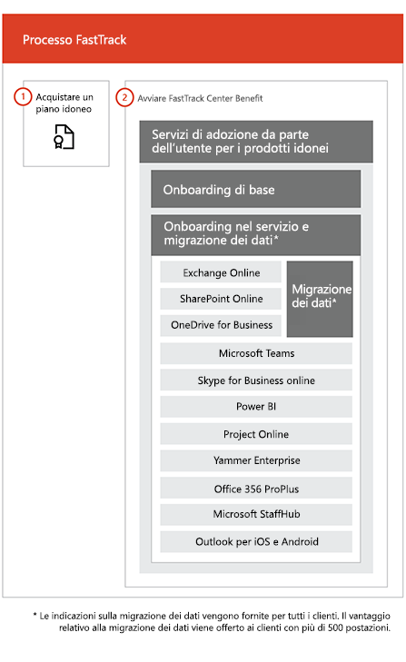

# Il processo FastTrack

Il processo FastTrack fornisce assistenza per onboarding e servizi di adozione da parte dell'utente. 
  
L'onboarding consiste di:
  
- *Onboarding di base*: si tratta di attività necessarie per la configurazione del tenant e l'integrazione con Azure Active Directory (Azure AD), se richiesta. L'onboarding di base fornisce, inoltre, la linea di base per l'onboarding di altri servizi. 
- *Onboarding dei servizi e migrazione*: le attività di onboarding dei servizi abilitano gli scenari nel tenant. La migrazione dei dati (posta elettronica e file inclusi) verrà trattata in [Migrazione dei dati](O365-data-migration.md). 
    
I servizi di adozione da parte dell'utente comprendono attività che rendono gli utenti consapevoli dei servizi idonei e che è possibile utilizzare per creare valore aziendale. Questa assistenza viene fornita parallelamente alle attività di onboarding.
  
> [!NOTE]
> FastTrack offre ai clienti un approccio consigliato, linee guida e procedure consigliate progettate per ottenere risultati rapidi e prevedibili. Se si sceglie di eseguire la distribuzione senza seguire questa guida, ciò potrebbe influire sull'esperienza di onboarding e sull'utilizzo del servizio. L'assistenza viene definita come una combinazione di supporto in forma orale e scritta. Quando gli esperti di FastTrack offrono assistenza, il personale di FastTrack non può agire per conto dell'utente. È possibile utilizzare i servizi FastTrack per eseguire l'onboarding e adottare un flusso di lavoro idoneo, a condizione che la sottoscrizione sia attiva.  
  
## Il processo di onboarding

Nel diagramma seguente viene illustrata la procedura relativa all'onboarding.
  

  
È possibile ottenere assistenza tramite l'interfaccia di amministrazione di Office 365 oppure il [sito FastTrack site](https://go.microsoft.com/fwlink/?linkid=780698). Per ottenere assistenza tramite interfaccia di amministrazione di Office 365, è necessario chiudere l'interfaccia di amministrazione e fare clic sul widget **Ti serve assistenza?**. Per ottenere assistenza tramite il [sito FastTrack site](https://go.microsoft.com/fwlink/?linkid=780698), accedere, fare clic su **Servizi**, quindi completare il modulo **Richiesta di assistenza per Office 365**. 
    
> [!NOTE]
>  Se si dispone di un partner elencato nel tenant di Office 365, questa opzione non è visualizzata. Per assistenza, consultare il partner. 
  
 È inoltre possibile richiedere assistenza per FastTrack Center dal [sito FastTrack](https://go.microsoft.com/fwlink/?linkid=780698) nell'elenco dei servizi disponibili per il tenant. 
    
 Una volta contattata l’assistenza per l'onboarding, verrà impostata la pianificazione delle riunioni in linea.
    
I partner possono anche ricevere assistenza tramite il [sito FastTrack](https://go.microsoft.com/fwlink/?linkid=780698) per conto di un cliente. Per farlo, il partner accede al sito, seleziona il record del cliente, fa clic su **Servizi** e completa il modulo **Richiesta di assistenza per Office 365**. 

Nella tabella seguente sono elencati i ruoli e le responsabilità per il processo.
    
|||
|:-----|:-----|
|**Ruolo**   |**Responsabilità**   |
|**Esperto FastTrack**   |Fornisce tutti i servizi di onboarding, migrazione e adozione da parte dell'utente in remoto.    Offre assistenza in remoto, sfruttando una combinazione di strumenti e documentazione pubblicata.   Lavora direttamente con l'utente o con il rappresentante.   Offre linee guida sulla migrazione dei dati e della posta elettronica.|
|**FastTrack Center**    |Offre assistenza all'utente nell'onboarding di base e dei servizi e nella pianificazione dell'adozione corretta di servizi idonei.    Offre assistenza ed è disponibile durante il regolare orario lavorativo in base all'area.   Offre assistenza in cinese tradizionale e cinese semplificato (le risorse parlano solo cinese mandarino), inglese, francese, tedesco, italiano, giapponese, coreano, portoghese (Brasile), spagnolo, tailandese e vietnamita.|

  

