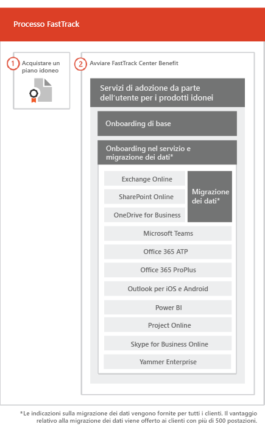

# Il processo FastTrackThe FastTrack Process

Il processo FastTrack fornisce assistenza per onboarding e servizi di adozione da parte dell'utente.The FastTrack process provides onboarding and user adoption services. 
  
L'onboarding consiste di:Onboarding consists of:
  
- *Onboarding di base*: si tratta di attività necessarie per la configurazione del tenant e l'integrazione con Azure Active Directory (Azure AD), se richiesta. L'onboarding di base fornisce, inoltre, la linea di base per l'onboarding di altri servizi.*Core onboarding* — These are tasks required for tenant configuration and integration with Azure Active Directory (Azure AD) if needed. Core onboarding also provides the baseline for onboarding other eligible services. 
- *Onboarding dei servizi e migrazione*: le attività di onboarding dei servizi abilitano gli scenari nel tenant. La migrazione dei dati (posta elettronica e file inclusi) verrà trattata in [Migrazione dei dati](O365-data-migration.md).*Service onboarding and migration* — Service onboarding tasks enable scenarios in your tenant. Data migration (including email and files) is covered in [Data Migration](O365-data-migration.md). 
    
I servizi di adozione da parte dell'utente comprendono attività che rendono gli utenti consapevoli dei servizi idonei e che è possibile utilizzare per creare valore aziendale. Questa assistenza viene fornita parallelamente alle attività di onboarding.User adoption services are comprised of tasks that provide guidance for you to ensure your users are aware of the eligible services and can use them to drive business value. This assistance occurs in parallel to onboarding activities.
  
> [!NOTE]
> FastTrack offre ai clienti un approccio consigliato, linee guida e procedure consigliate progettate per ottenere risultati rapidi e prevedibili. Se si sceglie di eseguire la distribuzione senza seguire questa guida, ciò potrebbe influire sull'esperienza di onboarding e sull'utilizzo del servizio. L'assistenza viene definita come una combinazione di supporto in forma orale e scritta. Quando gli esperti di FastTrack offrono assistenza, il personale di FastTrack non può agire per conto dell'utente. È possibile utilizzare i servizi FastTrack per eseguire l'onboarding e adottare un flusso di lavoro idoneo, a condizione che la sottoscrizione sia attiva. FastTrack provides customers with a recommended approach, guidance, and best practices engineered to deliver quick and predictable outcomes. If you choose to deploy outside of this guidance, your onboarding experience and usage of the service may be impacted. Guidance is defined as a combination of verbal and written assistance. When FastTrack Specialists provide guidance, FastTrack personnel cannot act on your behalf. You can use FastTrack services to onboard and adopt any qualifying product workload as long as your subscription is current. 
  
## Il processo di onboardingThe onboarding process

Nel diagramma seguente viene illustrata la procedura relativa all'onboarding.The following diagram illustrates the onboarding process.
  

  
È possibile ottenere assistenza tramite l'[interfaccia di amministrazione di Microsoft 365](https://go.microsoft.com/fwlink/?linkid=2032704) o il [sito di FastTrack](https://go.microsoft.com/fwlink/?linkid=780698).You can get help through the [Microsoft 365 admin center](https://go.microsoft.com/fwlink/?linkid=2032704) or the [FastTrack site](https://go.microsoft.com/fwlink/?linkid=780698). 

Per ottenere assistenza tramite l'[interfaccia di amministrazione di Microsoft 365](https://go.microsoft.com/fwlink/?linkid=2032704), l'amministratore accede all'interfaccia di amministrazione e quindi fa clic sul widget **Serve aiuto?**.To get help through the [Microsoft 365 admin center](https://go.microsoft.com/fwlink/?linkid=2032704), your admin signs into the admin center and then clicks the **Need help?** widget. 

Per ottenere assistenza tramite il [sito di FastTrack](https://go.microsoft.com/fwlink/?linkid=780698):To get help through the [FastTrack site](https://go.microsoft.com/fwlink/?linkid=780698): 
1.  Accedere al [sito di FastTrack](https://go.microsoft.com/fwlink/?linkid=780698).Sign in to the [FastTrack site](https://go.microsoft.com/fwlink/?linkid=780698). 
2.  Selezionare **Servizi**.Select **Services**.
3.  Completare il modulo **Richiesta di assistenza con Microsoft 365**.Complete the **Request for Assistance with Microsoft 365** form. 
  
 È inoltre possibile richiedere assistenza per FastTrack Center dal [sito di FastTrack](https://go.microsoft.com/fwlink/?linkid=780698) nell'elenco dei servizi disponibili per il tenant.You can also ask for FastTrack Center help from the [FastTrack site](https://go.microsoft.com/fwlink/?linkid=780698) in the list of available services for your tenant. 
    
 Una volta contattata l'assistenza per l'onboarding, verrà impostata la pianificazione delle riunioni in linea.Once onboarding assistance starts, we set up a schedule of online meetings.
    
I partner possono anche ricevere assistenza tramite il [sito di FastTrack](https://go.microsoft.com/fwlink/?linkid=780698) per conto di un cliente. A tale scopo:Partners can also get help through the [FastTrack site](https://go.microsoft.com/fwlink/?linkid=780698) on behalf of a customer. To do so:
1.  Accedere al [sito di FastTrack](https://go.microsoft.com/fwlink/?linkid=780698).Sign in to the [FastTrack site](https://go.microsoft.com/fwlink/?linkid=780698). 
2.  Selezionare **Clienti personali**.Select **My Customers**.
3.  Cercare il cliente desiderato o selezionarlo nell'elenco di clienti.Search for your customer or select them from your customer list.
4.  Selezionare **Servizi**.Select **Services**.
5.  Completare il modulo **Richiesta di assistenza con Microsoft 365**.Complete the **Request for Assistance with Microsoft 365** form. 

Nella tabella seguente sono elencati i ruoli e le responsabilità per il processo.The following table lists roles and responsibilities for the process.
    
|||
|:-----|:-----|
|**Ruolo****Role**   |**Responsabilità****Responsibility**   |
|**Esperto FastTrack****FastTrack Specialist**   |Fornisce tutti i servizi di onboarding, migrazione e adozione da parte dell'utente in remoto.Provides all onboarding, migration, and user adoption services remotely.    Offre assistenza in remoto, sfruttando una combinazione di strumenti e documentazione pubblicata.Assists you remotely by using a combination of tools and published documentation.   Lavora direttamente con l'utente o con il rappresentante.Works directly with you or your representative.   Offre linee guida sulla migrazione dei dati e della posta elettronica.Provides email and data migration guidance.|
|**FastTrack Center****FastTrack Center**    |Offre assistenza all'utente nell'onboarding di base e dei servizi e nella pianificazione dell'adozione corretta di servizi idonei.Provides guidance with core and service onboarding and planning successful adoption of eligible services.    Offre assistenza ed è disponibile durante il regolare orario lavorativo in base all'area.Provides assistance and is available during normal business hours for a given region.   Offre assistenza in cinese tradizionale e cinese semplificato (le risorse parlano solo cinese mandarino), inglese, francese, tedesco, italiano, giapponese, coreano, portoghese (Brasile), spagnolo, tailandese e vietnamita.Provides assistance in Traditional Chinese and Simplified Chinese (resources speak Mandarin only), English, French, German, Italian, Japanese, Korean, Portuguese (Brazil), Spanish, Thai, and Vietnamese.|

  

