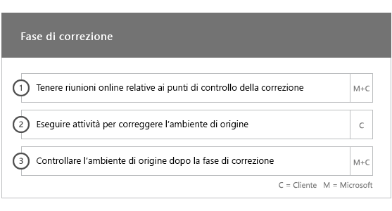
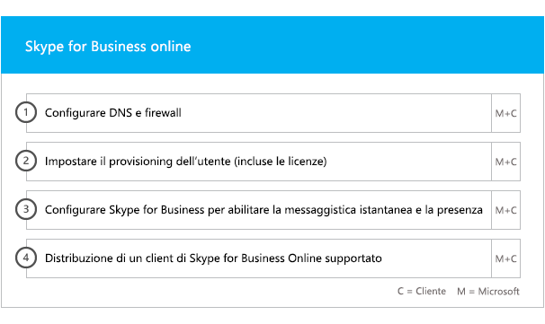

# Fasi del processo di onboarding e migrazione

Office 365 onboarding has four primary phases—Initiate, Assess, Remediate, and Enable. You can follow these phases with an optional data migration phase as shown in the following figure.
  

  
> [!NOTE]
>Per informazioni sul processo di onboarding e migrazione per Office 365 US Government, vedere [Processo di onboarding e migrazione per Office 365 US Government](US-Gov-appendix-onboarding-and-migration.md). 

Per le attività dettagliate di ogni fase, vedere [Responsabilità di FastTrack](O365-fasttrack-responsibilities.md) e [Responsabilità dell'utente](O365-your-responsibilities.md).
  
## Fase di avvio

Dopo aver acquistato i tipi e il numero appropriato di licenze, attenersi alle istruzioni nell'e-mail di conferma dell'acquisto per associare le licenze al tenant esistente o nuovo. 
  
È possibile ottenere assistenza tramite l'[interfaccia di amministrazione di Microsoft 365](https://go.microsoft.com/fwlink/?linkid=2032704) o il [sito di FastTrack](https://go.microsoft.com/fwlink/?linkid=780698). 

Per ottenere assistenza tramite l'[interfaccia di amministrazione di Microsoft 365](https://go.microsoft.com/fwlink/?linkid=2032704), l'amministratore accede all'interfaccia di amministrazione e quindi fa clic sul widget **Serve aiuto?**. 

Per ottenere assistenza tramite il [sito di FastTrack](https://go.microsoft.com/fwlink/?linkid=780698): 
1.    Accedere al [sito di FastTrack](https://go.microsoft.com/fwlink/?linkid=780698). 
2.    Selezionare **Richiedi assistenza per Microsoft 365** in **Azioni rapide** nella parte superiore della pagina di destinazione o selezionando **Richiedi assistenza per Microsoft 365** nella scheda di distribuzione.
3.    Completare il modulo di **Richiesta di assistenza per Microsoft 365**. 
  
Partners can also get help through the [FastTrack site](https://go.microsoft.com/fwlink/?linkid=780698) on behalf of a customer. To do so:
1.    Accedere al [sito di FastTrack](https://go.microsoft.com/fwlink/?linkid=780698). 
2.    Selezionare **Clienti personali**.
3.    Cercare il cliente desiderato o selezionarlo nell'elenco di clienti.
4.    Selezionare **Servizi**.
5.    Completare il modulo di **Richiesta di assistenza per Microsoft 365**.

È inoltre possibile richiedere assistenza per FastTrack Center dal [sito di FastTrack](https://go.microsoft.com/fwlink/?linkid=780698) nell'elenco dei servizi disponibili per il tenant. 
    
During this phase, we discuss the onboarding process, verify your data, and set up a kickoff meeting. This includes working with you to understand how you intend to use the service and your organization's goals and plans to drive service usage.
  

  
## Fase di valutazione

Your FastTrack Manager conducts an interactive success planning call with you and your adoption team. This introduces you to the capabilities of the eligible services you purchased, the key foundations you need for success, the methodology for driving usage of the service, and scenarios you can use to get value from the services. We assist you in success planning and provide feedback on key areas (as needed).
  
FastTrack Specialists work with you to assess your source environment and the requirements. We provide tools for you to gather data about your environment and  guide you through estimating bandwidth requirements and assessing your internet browsers, client operating systems, Domain Name System (DNS), network, infrastructure, and identity system to determine if any changes are required for onboarding. 
  
Based on your current setup, we provide a remediation plan that brings your source environment up to the minimum requirements for successful onboarding to Office 365 and, if needed, for successful mailbox and/or data migration. We provide a set of suggested activities to increase end user value and adoption. We also set up appropriate checkpoint calls for the Remediate phase.
  

  
## Fase di correzione

L'utente esegue le attività di correzione basate sull'ambiente di origine, per soddisfare i requisiti per l'onboarding, l'adozione e la migrazione di ciascun servizio in base alle esigenze.
  

  
We also provide a set of suggested activities to increase end user value and adoption. Before beginning the Enable phase, we jointly verify the outcomes of the remediation activities to make sure you're ready to proceed. 
  
In questa fase, il responsabile FastTrack assiste l'utente nella pianificazione, guidandolo nella scelta delle risorse e delle procedure migliori per offrire assistenza e rendere il servizio disponibile per l'organizzazione e gestire l'uso dei servizi.
  
## Fase di attivazione

Una volta completate tutte le attività di correzione, si passa alla configurazione dell'infrastruttura di base per l'utilizzo dei servizi, per il provisioning di Office 365 e per l'esecuzione di attività che consentano l'adozione dei servizi. 
  
## Componenti di base

Core onboarding involves service provisioning and tenant and identity integration. It also includes steps for providing a foundation for onboarding services like Exchange Online, SharePoint Online, and Skype for Business Online. You and your FastTrack Manager continue to have success planning checkpoint meetings to evaluate progress against your goals and determine what further assistance you need.
  

  

  
> [!NOTE]
> WAP stands for Web Application Proxy. SSL stands for Secure Sockets Layer. SDS stands for School Data Sync. For more information on SDS, see [Welcome to Microsoft School Data Sync](https://go.microsoft.com/fwlink/?linkid=871480). 
  
L'onboarding per uno o più servizi può iniziare al termine dell'onboarding di base.
  
## Exchange Online

For Exchange Online, we guide you through the process to get your organization ready to use email. The exact steps, depending on your source environment and your email migration plans, can include providing guidance for:
- Configurare le funzionalità di Exchange Online Protection (EOP) per tutti i domini abilitati alla posta elettronica convalidati in Office 365.
    > [!NOTE]
    > I record MX (Mail Exchange) devono puntare a Office 365. 
- Configurare la funzionalità Office 365 Advanced Threat Protection (ATP) se rientra nel servizio di sottoscrizione. Per ulteriori informazioni, vedere [Office 365 Advanced Threat Protection](#office-365-advanced-threat-protection).
- Setting up the data loss prevention (DLP) feature for all mail-enabled domains validated in Office 365 as part of your subscription service. This is done once your MX records point to Office 365.
- Setting up Office 365 Message Encryption (OME) for all mail-enabled domains validated in Office 365 as part of your subscription service. This is done once your MX records point to Office 365.

> [!NOTE]
> Il servizio Replica delle cassette postali tenta di eseguire la migrazione dei messaggi di posta elettronica protetti da Information Rights Managed (IRM) dalla cassetta postale dell'utente alla cassetta postale di Exchange Online corrispondente. La possibilità di leggere i contenuti protetti dopo la migrazione dipende dal fatto che il cliente esegua il mapping e copi i modelli di Active Directory Rights Managed Services (AD RMS) in Azure Rights Management Service (Azure RMS).

- Configurazione delle porte del firewall.
- Impostare DNS, incluso il servizio obbligatorio di Autodiscover, SPF (Sender Policy Framework) e i record MX, se necessario. 
- Configurare il flusso di posta elettronica tra l'ambiente di messaggistica di origine e Exchange Online (in base alle esigenze).
- Eseguire la migrazione della posta dall'ambiente di messaggistica di origine a Office 365.
- Configurazione di client delle cassette postali (Outlook per Windows, Outlook sul web e Outlook per iOS e Android).
    > [!NOTE]
    > Per ulteriori informazioni sulla migrazione della posta e dei dati, vedere [Migrazione dei dati](O365-data-migration.md). 
  

  
## SharePoint Online e OneDrive for Business

Per SharePoint Online e OneDrive for Business, viene fornito materiale sussidiario per:
- Configurazione DNS.
- Configurazione delle porte del firewall.
- Provisioning di utenti e licenze.   
- Configurazione delle funzionalità dell'ambiente ibrido di SharePoint, come la ricerca ibrida, i siti ibridi, la tassonomia ibrida, i tipi di contenuto, la creazione siti in modalità self-service ibrida (solo SharePoint Server 2013), l'icona di avvio delle app estesa, OneDrive for Business ibrido e i siti extranet.
    
Gli esperti di FastTrack forniscono una guida sulla procedura di migrazione di dati a Office 365 mediante una combinazione di strumenti e documentazione nonché eseguendo le attività di configurazione se applicabili e possibili.
  

  
## OneDrive for Business

Per OneDrive for Business, la procedura dipende dal corrente utilizzo o meno di SharePoint e, in caso affermativo, dalla versione utilizzata.  
  

  
## Office 365 Advanced Threat Protection

Per Office 365 ATP, viene fornito materiale sussidiario per:
- Abilitazione di Collegamenti sicuri, Allegati sicuri e anti-phishing. 
- Configurazione di automazione, analisi e risposta.
- Uso del simulatore di attacchi.
- Creazione di report e analisi delle minacce.

## Microsoft Information Governance

Per la governance di Microsoft Information sono disponibili indicazioni per:

- Governance delle informazioni.
- Etichette e criteri di conservazione.
- Gestione dei record.
- Criteri di eliminazione.
- Conformità delle comunicazioni.
- Gestione dei rischi Insider 
- Advanced eDiscovery.

## Microsoft Azure Information Protection

Per Microsoft Information Protection sono disponibili indicazioni per:
- Conoscere i dati tramite Esplora contenuto ed Esplora attività.
- Etichette di riservatezza.
- Classificazione dei dati.
- Criteri di prevenzione della perdita dei dati (DLP) per chat e canali di Microsoft Teams.
- Protezione dei dati.
- Etichettatura unificata.

## Microsoft Teams

Per Microsoft StaffHub viene fornito materiale sussidiario per:
- Conferma dei requisiti minimi.  
- Configurazione delle porte del firewall.   
- Configurazione DNS. 
- Conferma dell'abilitazione di Microsoft Teams sul tenant Office 365.  
- Abilitazione o disabilitazione delle licenze utente.
    

## Skype for Business online

Per Skype for Business Online, viene fornito materiale sussidiario per:
- Configurazione delle porte del firewall.
- Configurazione DNS.   
- Creare account per qualsiasi dispositivo del sistema chat room.   
- Distribuire un client Skype for Business online supportato.  
- Stabilire una configurazione del server di dominio condiviso tra l'ambiente server di Lync 2010, Lync 2013 o Skype for Business 2015 e il tenant di Skype for Business online (se applicabile), Piani di chiamata, Skype Meeting Broadcast e sistema telefonico con piani relativi alle chiamate (nei mercati in cui è disponibile).
    

  

  
## Power BI

Per Power BI, viene fornito materiale sussidiario per: 
- Assegnare licenze di Power BI.
- Distribuire l'app Power BI Desktop.
    
## Project Online

Per Project Online, viene fornito materiale sussidiario per:
  
- Verificare la funzionalità di base di SharePoint sulla quale fa affidamento Project Online.   
- Aggiungere il servizio Project Online al tenant (inclusa l'aggiunta di sottoscrizioni per gli utenti).  
- Configurare il pool di risorse organizzazione (ERP). 
- Creare il primo progetto. 
    

  
## Project Online Professional e Project Online Premium

Per Project Online Professional e Project Online Premium, viene fornito materiale sussidiario per:
- Risolvere i problemi di implementazione.
- Assegnare i contratti di licenza con l'utente finale utilizzando l'[interfaccia di amministrazione di Microsoft 365](https://go.microsoft.com/fwlink/?linkid=2032704) e Windows PowerShell.  
- Installare Client desktop di Project Online dal portale di Office 365 tramite la tecnologia A portata di clic.
- Configurare le impostazioni di aggiornamento con lo strumento di distribuzione di Office 365.  
- Configurare un unico server di distribuzione nel sito per Client desktop di Project Online, includendo una guida per la creazione del file configuration.xml da usare con lo strumento di distribuzione di Office 365.  
- Connettere Client desktop di Project Online a Project Online Professional o Project Online Premium.
    

  
## Yammer Enterprise

Per Yammer, viene fornito materiale sussidiario per l'attivazione del servizio Yammer Enterprise.
  
## Microsoft 365 Apps

Nel caso di Microsoft 365 Apps, viene fornita una guida per gli aspetti seguenti:
- Risoluzione dei problemi di implementazione.   
- Assegnazione dei contratti di licenza con l'utente finale e di licenze basate sul dispositivo utilizzando l'[interfaccia di amministrazione di Microsoft 365](https://go.microsoft.com/fwlink/?linkid=2032704) e Windows PowerShell. 
- Installare Microsoft 365 Apps dal portale di Office 365 tramite la tecnologia A portata di clic.   
- Installazione delle app di Office Mobile (ad esempio Outlook Mobile, Word Mobile, Excel Mobile e PowerPoint Mobile) sui dispositivi iOS o Android.   
- Configurare le impostazioni di aggiornamento con lo strumento di distribuzione di Office 365.   
- Selezione e configurazione di un'installazione locale o cloud. 
- Creazione del codice XML di configurazione dello Strumento di distribuzione di Office con lo Strumento di personalizzazione di Office o del codice XML nativo per configurare il pacchetto di distribuzione.  
- Distribuzione con Microsoft Endpoint Configuration Manager, che include una guida per la creazione del pacchetto di Microsoft Endpoint Configuration Manager.
    

  
## Outlook per iOS e Android

Per Outlook per iOS e Android, sono disponibili indicazioni su:
- Download di Outlook per iOS e Android tramite l'Apple App Store e Google Play.
- Configurazione degli account e accesso alla cassetta postale di Exchange Online.
