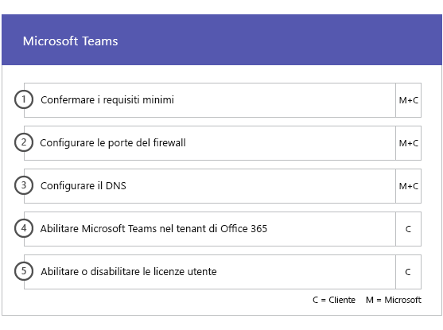
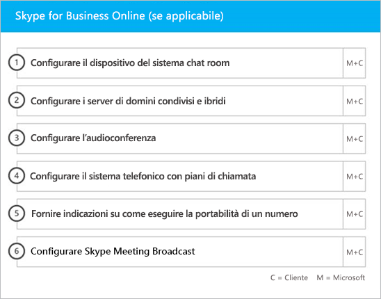

# Fasi del processo di onboarding e migrazioneOnboarding and Migration Phases

Office 365 onboarding has four primary phases—Initiate, Assess, Remediate, and Enable.Office 365 onboarding has four primary phases—Initiate, Assess, Remediate, and Enable. You can follow these phases with an optional data migration phase as shown in the following figure.You can follow these phases with an optional data migration phase as shown in the following figure.
  

  
> [!NOTE]
>Per informazioni sul processo di onboarding e migrazione per Office 365 US Government, vedere [Processo di onboarding e migrazione per Office 365 US Government](US-Gov-appendix-onboarding-and-migration.md).For information on onboarding and migration for Office 365 US Government, see [Onboarding and Migration for Office 365 US Government](US-Gov-appendix-onboarding-and-migration.md). 

Per le attività dettagliate di ogni fase, vedere [Responsabilità di FastTrack](O365-fasttrack-responsibilities.md) e [Responsabilità dell'utente](O365-your-responsibilities.md).For detailed tasks for each phase, see [FastTrack Responsibilities](O365-fasttrack-responsibilities.md) and [Your Responsibilities](O365-your-responsibilities.md).
  
## Fase di avvioInitiate phase

Dopo aver acquistato i tipi e il numero appropriato di licenze, attenersi alle istruzioni nell'e-mail di conferma dell'acquisto per associare le licenze al tenant esistente o nuovo.After you purchase the appropriate number and types of licenses, follow the guidance from the purchase confirmation email to associate the licenses to your existing or new tenant. 
  
È possibile ottenere assistenza tramite l'[interfaccia di amministrazione di Microsoft 365](https://go.microsoft.com/fwlink/?linkid=2032704) o il [sito di FastTrack](https://go.microsoft.com/fwlink/?linkid=780698).You can get help through the [Microsoft 365 admin center](https://go.microsoft.com/fwlink/?linkid=2032704) or the [FastTrack site](https://go.microsoft.com/fwlink/?linkid=780698). 

Per ottenere assistenza tramite l'[interfaccia di amministrazione di Microsoft 365](https://go.microsoft.com/fwlink/?linkid=2032704), l'amministratore accede all'interfaccia di amministrazione e quindi fa clic sul widget **Serve aiuto?**.To get help through the [Microsoft 365 admin center](https://go.microsoft.com/fwlink/?linkid=2032704), your admin signs into the admin center and then clicks the **Need help?** widget. 

Per ottenere assistenza tramite il [sito di FastTrack](https://go.microsoft.com/fwlink/?linkid=780698):To get help through the [FastTrack site](https://go.microsoft.com/fwlink/?linkid=780698): 
1.    Accedere al [sito di FastTrack](https://go.microsoft.com/fwlink/?linkid=780698).Sign in to the [FastTrack site](https://go.microsoft.com/fwlink/?linkid=780698). 
2.    Selezionare **Richiedi assistenza per Microsoft 365** in **Azioni rapide** nella parte superiore della pagina di destinazione o selezionando **Richiedi assistenza per Microsoft 365** nella scheda di distribuzione.Select **Request assistance for Microsoft 365** from the **quick actions** on the top of your landing page or by selecting **Request assistance for Microsoft 365** on the deploy card.
3.    Completare il modulo di **Richiesta di assistenza per Microsoft 365**.Complete the **Request Assistance for Microsoft 365** form. 
  
Partners can also get help through the [FastTrack site](https://go.microsoft.com/fwlink/?linkid=780698) on behalf of a customer.Partners can also get help through the [FastTrack site](https://go.microsoft.com/fwlink/?linkid=780698) on behalf of a customer. To do so:To do so:
1.    Accedere al [sito di FastTrack](https://go.microsoft.com/fwlink/?linkid=780698).Sign in to the [FastTrack site](https://go.microsoft.com/fwlink/?linkid=780698). 
2.    Selezionare **Clienti personali**.Select **My Customers**.
3.    Cercare il cliente desiderato o selezionarlo nell'elenco di clienti.Search for your customer or select them from your customer list.
4.    Selezionare **Servizi**.Select **Services**.
5.    Completare il modulo di **Richiesta di assistenza per Microsoft 365**.Complete the **Request Assistance for Microsoft 365** form.

È inoltre possibile richiedere assistenza per FastTrack Center dal [sito di FastTrack](https://go.microsoft.com/fwlink/?linkid=780698) nell'elenco dei servizi disponibili per il tenant.You can also ask for FastTrack Center help from the [FastTrack site](https://go.microsoft.com/fwlink/?linkid=780698) in the list of available services for your tenant. 
    
During this phase, we discuss the onboarding process, verify your data, and set up a kickoff meeting.During this phase, we discuss the onboarding process, verify your data, and set up a kickoff meeting. This includes working with you to understand how you intend to use the service and your organization's goals and plans to drive service usage.This includes working with you to understand how you intend to use the service and your organization's goals and plans to drive service usage.
  

  
## Fase di valutazioneAssess phase

Your FastTrack Manager conducts an interactive success planning call with you and your adoption team.Your FastTrack Manager conducts an interactive success planning call with you and your adoption team. This introduces you to the capabilities of the eligible services you purchased, the key foundations you need for success, the methodology for driving usage of the service, and scenarios you can use to get value from the services.This introduces you to the capabilities of the eligible services you purchased, the key foundations you need for success, the methodology for driving usage of the service, and scenarios you can use to get value from the services. We assist you in success planning and provide feedback on key areas (as needed).We assist you in success planning and provide feedback on key areas (as needed).
  
FastTrack Specialists work with you to assess your source environment and the requirements.FastTrack Specialists work with you to assess your source environment and the requirements. We provide tools for you to gather data about your environment and  guide you through estimating bandwidth requirements and assessing your internet browsers, client operating systems, Domain Name System (DNS), network, infrastructure, and identity system to determine if any changes are required for onboarding.We provide tools for you to gather data about your environment and  guide you through estimating bandwidth requirements and assessing your internet browsers, client operating systems, Domain Name System (DNS), network, infrastructure, and identity system to determine if any changes are required for onboarding. 
  
Based on your current setup, we provide a remediation plan that brings your source environment up to the minimum requirements for successful onboarding to Office 365 and, if needed, for successful mailbox and/or data migration.Based on your current setup, we provide a remediation plan that brings your source environment up to the minimum requirements for successful onboarding to Office 365 and, if needed, for successful mailbox and/or data migration. We provide a set of suggested activities to increase end user value and adoption.We provide a set of suggested activities to increase end user value and adoption. We also set up appropriate checkpoint calls for the Remediate phase.We also set up appropriate checkpoint calls for the Remediate phase.
  

  
## Fase di correzioneRemediate phase

L'utente esegue le attività di correzione basate sull'ambiente di origine, per soddisfare i requisiti per l'onboarding, l'adozione e la migrazione di ciascun servizio in base alle esigenze.You do the remediation tasks based on your source environment so that you meet the requirements for onboarding, adopting, and migrating each service as needed.
  

  
We also provide a set of suggested activities to increase end user value and adoption.We also provide a set of suggested activities to increase end user value and adoption. Before beginning the Enable phase, we jointly verify the outcomes of the remediation activities to make sure you're ready to proceed.Before beginning the Enable phase, we jointly verify the outcomes of the remediation activities to make sure you're ready to proceed. 
  
In questa fase, il responsabile FastTrack assiste l'utente nella pianificazione, guidandolo nella scelta delle risorse e delle procedure migliori per offrire assistenza e rendere il servizio disponibile per l'organizzazione e gestire l'uso dei servizi.During this phase, your FastTrack Manager works with you on success planning, guiding you to the right resources and best practices to provide guidance for you to make the service available to your organization and drive usage across the services.
  
## Fase di attivazioneEnable phase

Una volta completate tutte le attività di correzione, si passa alla configurazione dell'infrastruttura di base per l'utilizzo dei servizi, per il provisioning di Office 365 e per l'esecuzione di attività che consentano l'adozione dei servizi.When all remediation activities are complete, the focus shifts to configuring the core infrastructure for service consumption, provisioning Office 365, and conducting the activities to drive service adoption. 
  
## Componenti di baseCore

Core onboarding involves service provisioning and tenant and identity integration.Core onboarding involves service provisioning and tenant and identity integration. It also includes steps for providing a foundation for onboarding services like Exchange Online, SharePoint Online, and Skype for Business Online.It also includes steps for providing a foundation for onboarding services like Exchange Online, SharePoint Online, and Skype for Business Online. You and your FastTrack Manager continue to have success planning checkpoint meetings to evaluate progress against your goals and determine what further assistance you need.You and your FastTrack Manager continue to have success planning checkpoint meetings to evaluate progress against your goals and determine what further assistance you need.
  

  

  
> [!NOTE]
> WAP stands for Web Application Proxy.WAP stands for Web Application Proxy. SSL stands for Secure Sockets Layer.SSL stands for Secure Sockets Layer. SDS stands for School Data Sync. For more information on SDS, see [Welcome to Microsoft School Data Sync](https://go.microsoft.com/fwlink/?linkid=871480).SDS stands for School Data Sync. For more information on SDS, see [Welcome to Microsoft School Data Sync](https://go.microsoft.com/fwlink/?linkid=871480). 
  
L'onboarding per uno o più servizi può iniziare al termine dell'onboarding di base.Onboarding for one or more eligible services can begin once core onboarding is finished.
  
## Exchange OnlineExchange Online

For Exchange Online, we guide you through the process to get your organization ready to use email.For Exchange Online, we guide you through the process to get your organization ready to use email. The exact steps, depending on your source environment and your email migration plans, can include providing guidance for:The exact steps, depending on your source environment and your email migration plans, can include providing guidance for:
- Configurare le funzionalità di Exchange Online Protection (EOP) per tutti i domini abilitati alla posta elettronica convalidati in Office 365.Setting up Exchange Online Protection (EOP) features for all mail-enabled domains validated in Office 365.
    > [!NOTE]
    > I record MX (Mail Exchange) devono puntare a Office 365.Your mail exchange (MX) records must point to Office 365. 
- Configurare la funzionalità Office 365 Advanced Threat Protection (ATP) se rientra nel servizio di sottoscrizione.Setting up the Office 365 Advanced Threat Protection (ATP) feature if it's part of your subscription service. Per ulteriori informazioni, vedere [Office 365 Advanced Threat Protection](#office-365-advanced-threat-protection).For more information, see [Office 365 Advanced Threat Protection](#office-365-advanced-threat-protection).
- Setting up the data loss prevention (DLP) feature for all mail-enabled domains validated in Office 365 as part of your subscription service.Setting up the data loss prevention (DLP) feature for all mail-enabled domains validated in Office 365 as part of your subscription service. This is done once your MX records point to Office 365.This is done once your MX records point to Office 365.
- Setting up Office 365 Message Encryption (OME) for all mail-enabled domains validated in Office 365 as part of your subscription service.Setting up Office 365 Message Encryption (OME) for all mail-enabled domains validated in Office 365 as part of your subscription service. This is done once your MX records point to Office 365.This is done once your MX records point to Office 365.

> [!NOTE]
> Il servizio Replica delle cassette postali tenta di eseguire la migrazione dei messaggi di posta elettronica protetti da Information Rights Managed (IRM) dalla cassetta postale dell'utente alla cassetta postale di Exchange Online corrispondente.The Mailbox Replication service (MRS) attempts to migrate Information Rights Managed (IRM) emails from your on-premises mailbox to the corresponding Exchange Online mailbox. La possibilità di leggere i contenuti protetti dopo la migrazione dipende dal fatto che il cliente esegua il mapping e copi i modelli di Active Directory Rights Managed Services (AD RMS) in Azure Rights Management Service (Azure RMS).Ability to read the protected content post-migration depends on the customer mapping and copying Active Directory Rights Managed Services (AD RMS) templates to the Azure Rights Management Service (Azure RMS).

- Configurazione delle porte del firewall.Configuring firewall ports.
- Impostare DNS, incluso il servizio obbligatorio di Autodiscover, SPF (Sender Policy Framework) e i record MX, se necessario.Setting up DNS, including the required Autodiscover, sender policy framework (SPF), and MX records (as needed). 
- Configurare il flusso di posta elettronica tra l'ambiente di messaggistica di origine e Exchange Online (in base alle esigenze).Setting up email flow between your source messaging environment and Exchange Online (as needed).
- Eseguire la migrazione della posta dall'ambiente di messaggistica di origine a Office 365.Undertaking mail migration from your source messaging environment to Office 365.
- Configurazione di client delle cassette postali (Outlook per Windows, Outlook sul web e Outlook per iOS e Android).Configuring mailbox clients (Outlook for Windows, Outlook on the web, and Outlook for iOS and Android).
    > [!NOTE]
    > Per ulteriori informazioni sulla migrazione della posta e dei dati, vedere [Migrazione dei dati](O365-data-migration.md).For more information on mail and data migration, see [Data Migration](O365-data-migration.md). 
  

  
## SharePoint Online e OneDrive for BusinessSharePoint Online and OneDrive for Business

Per SharePoint Online e OneDrive for Business, viene fornito materiale sussidiario per:For SharePoint Online and OneDrive for Business, we provide guidance for:
- Configurazione DNS.Setting up DNS.
- Configurazione delle porte del firewall.Configuring firewall ports.
- Provisioning di utenti e licenze.Provisioning users and licenses.   
- Configurazione delle funzionalità dell'ambiente ibrido di SharePoint, come la ricerca ibrida, i siti ibridi, la tassonomia ibrida, i tipi di contenuto, la creazione siti in modalità self-service ibrida (solo SharePoint Server 2013), l'icona di avvio delle app estesa, OneDrive for Business ibrido e i siti extranet.Configuring SharePoint hybrid features, like hybrid search, hybrid sites, hybrid taxonomy, content types, hybrid self-service site creation (SharePoint Server 2013 only), extended app launcher, hybrid OneDrive for Business, and extranet sites.
    
Gli esperti di FastTrack forniscono una guida sulla procedura di migrazione di dati a Office 365 mediante una combinazione di strumenti e documentazione nonché eseguendo le attività di configurazione se applicabili e possibili.FastTrack Specialists provide guidance on data migration to Office 365 by using a combination of tools and documentation and by performing configuration tasks where applicable and feasible.
  

  
## OneDrive for BusinessOneDrive for Business

Per OneDrive for Business, la procedura dipende dal corrente utilizzo o meno di SharePoint e, in caso affermativo, dalla versione utilizzata. For OneDrive for Business, the steps depend on if you're currently using SharePoint, and if so, which version. 
  

  
## Office 365 Advanced Threat ProtectionOffice 365 Advanced Threat Protection

Per Office 365 ATP, viene fornito materiale sussidiario per:For Office 365 ATP, we provide guidance for:
- Abilitazione di Collegamenti sicuri, Allegati sicuri e anti-phishing.Enabling Safe Links, Safe Attachments, and anti-phishing. 
- Configurazione di automazione, analisi e risposta.Configuring automation, investigation, and response.
- Uso del simulatore di attacchi.Using Attack Simulator.
- Creazione di report e analisi delle minacce.Reporting and threat analytics.

## Microsoft Information GovernanceMicrosoft Information Governance

Per la governance di Microsoft Information sono disponibili indicazioni per:For Microsoft Information Governance, we provide guidance for:

- Governance delle informazioni.Information governance.
- Etichette e criteri di conservazione.Retention labels and policies.
- Gestione dei record.Records management.
- Criteri di eliminazione.Deletion policies.
- Conformità delle comunicazioni.Communication compliance.
- Gestione dei rischi InsiderInsider risk management 
- Advanced eDiscovery.Advanced eDiscovery.

## Microsoft Azure Information ProtectionMicrosoft Information Protection

Per Microsoft Information Protection sono disponibili indicazioni per:For Microsoft Information Protection, we provide guidance for:
- Conoscere i dati tramite Esplora contenuto ed Esplora attività.Know your data through content explorer and activity explorer.
- Etichette di riservatezza.Sensitivity labels.
- Classificazione dei dati.Data classification.
- Criteri di prevenzione della perdita dei dati (DLP) per chat e canali di Microsoft Teams.Data loss protection (DLP) policies for Microsoft Teams chats and channels.
- Protezione dei dati.Information protection.
- Etichettatura unificata.Unified labeling.

## Microsoft TeamsMicrosoft Teams

Per Microsoft StaffHub viene fornito materiale sussidiario per:For Microsoft Teams, we provide guidance for:
- Conferma dei requisiti minimi.Confirming minimum requirements.  
- Configurazione delle porte del firewall.Configuring firewall ports.   
- Configurazione DNS.Setting up DNS. 
- Conferma dell'abilitazione di Microsoft Teams sul tenant Office 365.Confirming Microsoft Teams is enabled on your Office 365 tenant.  
- Abilitazione o disabilitazione delle licenze utente.Enabling or disabling user licenses.
    

## Skype for Business onlineSkype for Business Online

Per Skype for Business Online, viene fornito materiale sussidiario per:For Skype for Business Online, we provide guidance for:
- Configurazione delle porte del firewall.Configuring firewall ports.
- Configurazione DNS.Setting up DNS.   
- Creare account per qualsiasi dispositivo del sistema chat room.Creating accounts for any room system devices.   
- Distribuire un client Skype for Business online supportato.Deploying a supported Skype for Business Online client.  
- Stabilire una configurazione del server di dominio condiviso tra l'ambiente server di Lync 2010, Lync 2013 o Skype for Business 2015 e il tenant di Skype for Business online (se applicabile), Piani di chiamata, Skype Meeting Broadcast e sistema telefonico con piani relativi alle chiamate (nei mercati in cui è disponibile).Establishing split domain server configuration between your on-premises Lync 2010, Lync 2013, or Skype for Business 2015 server environment and Skype for Business Online tenant (if applicable), Calling Plans, Skype Meeting Broadcast, and Phone System and Calling Plans (in available markets).
    

  

  
## Power BIPower BI

Per Power BI, viene fornito materiale sussidiario per:For Power BI, we provide guidance for: 
- Assegnare licenze di Power BI.Assigning Power BI licenses.
- Distribuire l'app Power BI Desktop.Deploying the Power BI Desktop app.
    
## Project OnlineProject Online

Per Project Online, viene fornito materiale sussidiario per:For Project Online, we provide guidance for:
  
- Verificare la funzionalità di base di SharePoint sulla quale fa affidamento Project Online.Verifying basic SharePoint functionality that Project Online relies on.   
- Aggiungere il servizio Project Online al tenant (inclusa l'aggiunta di sottoscrizioni per gli utenti).Adding the Project Online service to your tenant (including adding subscriptions to users).  
- Configurare il pool di risorse organizzazione (ERP).Setting up the Enterprise Resource Pool (ERP). 
- Creare il primo progetto.Creating your first project. 
    

  
## Project Online Professional e Project Online PremiumProject Online Professional and Project Online Premium

Per Project Online Professional e Project Online Premium, viene fornito materiale sussidiario per:For Project Online Professional and Project Online Premium, we provide guidance for:
- Risolvere i problemi di implementazione.Addressing deployment issues.
- Assegnare i contratti di licenza con l'utente finale utilizzando l'[interfaccia di amministrazione di Microsoft 365](https://go.microsoft.com/fwlink/?linkid=2032704) e Windows PowerShell.Assigning end-user licenses using the [Microsoft 365 admin center](https://go.microsoft.com/fwlink/?linkid=2032704) and Windows PowerShell.  
- Installare Client desktop di Project Online dal portale di Office 365 tramite la tecnologia A portata di clic.Installing Project Online Desktop Client from the Office 365 portal using Click-to-Run.
- Configurare le impostazioni di aggiornamento con lo strumento di distribuzione di Office 365.Configuring update settings using the Office 365 Deployment Tool.  
- Configurare un unico server di distribuzione nel sito per Client desktop di Project Online, includendo una guida per la creazione del file configuration.xml da usare con lo strumento di distribuzione di Office 365.Setting up a single on-site distribution server for Project Online Desktop Client, including assistance with the creation of a configuration.xml file for use with the Office 365 Deployment Tool.  
- Connettere Client desktop di Project Online a Project Online Professional o Project Online Premium.Connecting Project Online Desktop Client to Project Online Professional or Project Online Premium.
    

  
## Yammer EnterpriseYammer Enterprise

Per Yammer, viene fornito materiale sussidiario per l'attivazione del servizio Yammer Enterprise.For Yammer, we provide guidance for enabling the Yammer Enterprise service.
  
## Microsoft 365 AppsMicrosoft 365 Apps

Nel caso di Microsoft 365 Apps, viene fornita una guida per gli aspetti seguenti:For Microsoft 365 Apps, we provide guidance for:
- Risoluzione dei problemi di implementazione.Addressing deployment issues.   
- Assegnazione dei contratti di licenza con l'utente finale e di licenze basate sul dispositivo utilizzando l'[interfaccia di amministrazione di Microsoft 365](https://go.microsoft.com/fwlink/?linkid=2032704) e Windows PowerShell.Assigning end-user and device-based licenses using the [Microsoft 365 admin center](https://go.microsoft.com/fwlink/?linkid=2032704) and Windows PowerShell. 
- Installare Microsoft 365 Apps dal portale di Office 365 tramite la tecnologia A portata di clic.Installing Microsoft 365 Apps from the Office 365 portal using Click-to-Run.   
- Installazione delle app di Office Mobile (ad esempio Outlook Mobile, Word Mobile, Excel Mobile e PowerPoint Mobile) sui dispositivi iOS o Android.Installing Office Mobile apps (like Outlook Mobile, Word Mobile, Excel Mobile, and PowerPoint Mobile) on your iOS or Android devices.   
- Configurare le impostazioni di aggiornamento con lo strumento di distribuzione di Office 365.Configuring update settings using the Office 365 Deployment Tool.   
- Selezione e configurazione di un'installazione locale o cloud.Selection and setup of a local or cloud installation. 
- Creazione del codice XML di configurazione dello Strumento di distribuzione di Office con lo Strumento di personalizzazione di Office o del codice XML nativo per configurare il pacchetto di distribuzione.Creation of the Office Deployment Tool configuration XML with the Office Customization Tool or native XML to configure the deployment package.  
- Distribuzione con Microsoft Endpoint Configuration Manager, che include una guida per la creazione del pacchetto di Microsoft Endpoint Configuration Manager.Deployment using Microsoft Endpoint Configuration Manager, including assistance with the creation of Microsoft Endpoint Configuration Manager packaging.
    

  
## Outlook per iOS e AndroidOutlook for iOS and Android

Per Outlook per iOS e Android, sono disponibili indicazioni su:For Outlook for iOS and Android, we provide guidance for:
- Download di Outlook per iOS e Android tramite l'Apple App Store e Google Play.Downloading Outlook for iOS and Android from the Apple App Store and Google Play.
- Configurazione degli account e accesso alla cassetta postale di Exchange Online.Configuring accounts and accessing the Exchange Online mailbox.
