# Fasi di onboarding e migrazione per Office 365 US Government

Il processo di onboarding di Office 365 prevede quattro fasi principali (ovvero avvio, valutazione, correzione e attivazione) che, come si può vedere nella figura seguente, possono essere seguite da una fase facoltativa di migrazione dei dati.
  
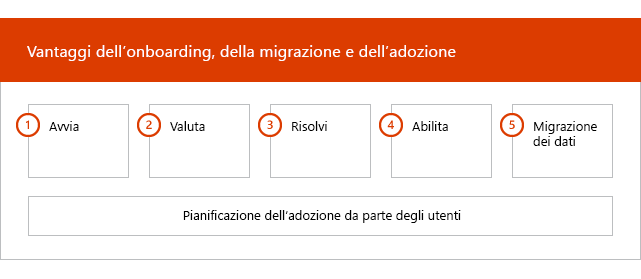
  
Per le attività dettagliate di ogni fase, vedere [FastTrack responsibilities for office 365 US Government](US-Gov-appendix-fasttrack-responsibilities.md) e [le proprie responsabilità per Office 365 US Government](US-Gov-appendix-your-responsibilities.md).
  
## Fase di avvio

Dopo aver acquistato i tipi e il numero appropriato di licenze, attenersi alle istruzioni nell'e-mail di conferma dell'acquisto per associare le licenze al tenant esistente o nuovo. 
  
È possibile ottenere assistenza tramite l'[interfaccia di amministrazione di Microsoft 365](https://go.microsoft.com/fwlink/?linkid=2032704) o il [sito di FastTrack](https://go.microsoft.com/fwlink/?linkid=780698). 
 
Per ottenere assistenza tramite l'[interfaccia di amministrazione di Microsoft 365](https://go.microsoft.com/fwlink/?linkid=2032704), l'amministratore accede all'interfaccia di amministrazione e quindi fa clic sul widget **Serve aiuto?**. 

Per ottenere assistenza tramite il [sito di FastTrack](https://go.microsoft.com/fwlink/?linkid=780698): 
1.    Accedere al [sito di FastTrack](https://go.microsoft.com/fwlink/?linkid=780698). 
2.    Selezionare **Richiedi assistenza per microsoft 365** dalle **azioni rapide** nella parte superiore della pagina di destinazione o selezionando **Richiedi assistenza per Microsoft 365** sulla scheda Distribuisci.
3. Completare il modulo di **Richiesta di assistenza per Microsoft 365**. 

I partner possono anche ricevere assistenza tramite il [sito di FastTrack](https://go.microsoft.com/fwlink/?linkid=780698) per conto di un cliente. A tale scopo:
1.    Accedere al [sito di FastTrack](https://go.microsoft.com/fwlink/?linkid=780698). 
2.    Selezionare **Clienti personali**.
3.    Cercare il cliente desiderato o selezionarlo nell'elenco di clienti.
4.    Selezionare **Servizi**.
5.    Completare il modulo di **Richiesta di assistenza per Microsoft 365**.   

È inoltre possibile richiedere assistenza per FastTrack Center dal [sito di FastTrack](https://go.microsoft.com/fwlink/?linkid=780698) nell'elenco dei servizi disponibili per il tenant. 
    
Durante questa fase, verrà discusso il processo di onboarding, saranno verificati i dati e verrà impostata la riunione iniziale.
  
Ciò include una collaborazione con l'utente per comprendere in che modo intende utilizzare il servizio e conoscere gli obiettivi aziendali relativi alla gestione del servizio.
  
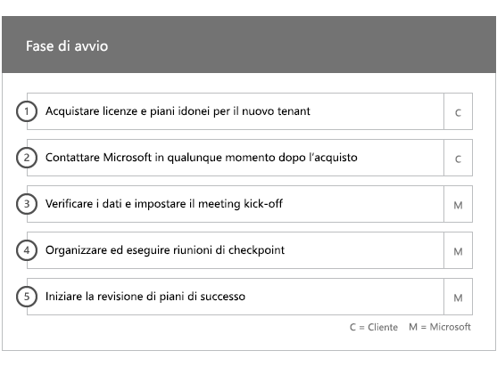
  
## Fase di valutazione

Il responsabile FastTrack effettua una chiamata interattiva con l'utente e il team di adozione per pianificare il buon esito del processo. In questo modo, l'utente viene a conoscenza delle capacità dei servizi idonei acquistati, degli elementi essenziali necessari, della metodologia per l'uso del servizio e degli scenari utili per sfruttare il servizio. Microsoft supporta l'utente nella pianificazione per il buon esito del processo e fornisce commenti e suggerimenti sulle aree principali (in base alle necessità).
  
Gli specialisti di FastTrack assistono l'utente nel valutare l'ambiente di origine e i requisiti. Sono disponibili strumenti che consentono di raccogliere i dati relativi all'ambiente e di valutare i requisiti di larghezza di banda e la valutazione dei browser Internet, del sistema operativo client, del sistema DNS (Domain Name System), della rete, dell'infrastruttura e dell'identità per determinare se le modifiche sono necessarie per l'onboarding. 
  
In base all'impostazione corrente, viene suggerito un piano di correzione che fornisce all'ambiente di origine i requisiti minimi per l'onboarding a Office 365 e, se necessario, per la migrazione dei dati e/o delle cassette postali. Viene offerta una serie di attività consigliate per aumentare l'adozione e il valore dell'utente finale. Vengono inoltre stabilite delle chiamate di controllo appropriate per la fase di correzione.
  
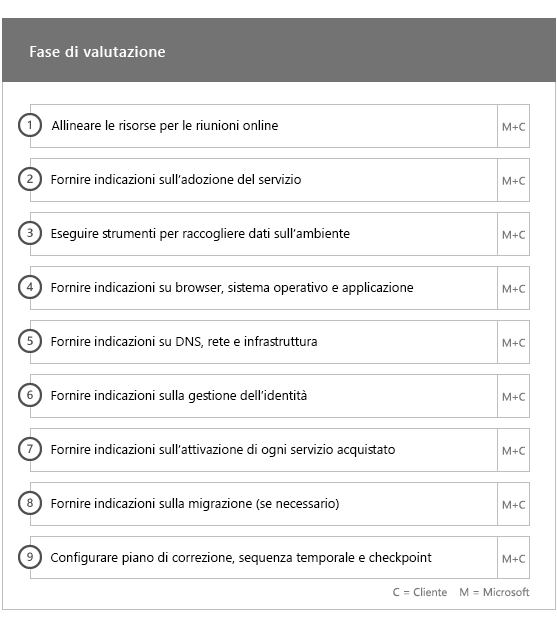
  
## Fase di correzione

L'utente esegue le attività di correzione basate sull'ambiente di origine, per soddisfare i requisiti per l'onboarding, l'adozione e la migrazione di ciascun servizio in base alle esigenze.
  
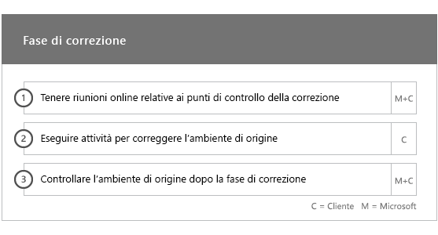
  
Viene inoltre fornita una serie di attività consigliate per aumentare l'adozione e il valore dell'utente finale. Prima di iniziare la fase di attivazione, vengono verificati i risultati delle attività di correzione per verificare che l'utente sia pronto a procedere. 
  
In questa fase, il responsabile FastTrack assiste l'utente nella pianificazione, guidandolo nella scelta delle risorse e delle procedure migliori per offrire assistenza e rendere il servizio disponibile per l'organizzazione e gestire l'uso dei servizi.
  
## Fase di attivazione

Una volta completate tutte le attività di correzione, si passa alla configurazione dell'infrastruttura di base per l'utilizzo dei servizi, per il provisioning di Office 365 e per l'esecuzione di attività che consentano l'adozione dei servizi. 
  
## Componenti di base

L'onboarding di base prevede il provisioning di servizi e l'integrazione di identità e tenant. Include inoltre la procedura per fornire una base per i servizi di onboarding quali Exchange Online, SharePoint Online e Skype for Business Online. L'utente e il responsabile FastTrack continuano ad avere riunioni periodiche per la pianificazione ottimale del processo al fine di valutare i progressi ottenuti rispetto agli obiettivi prefissati e determinare l'ulteriore supporto necessario.
  
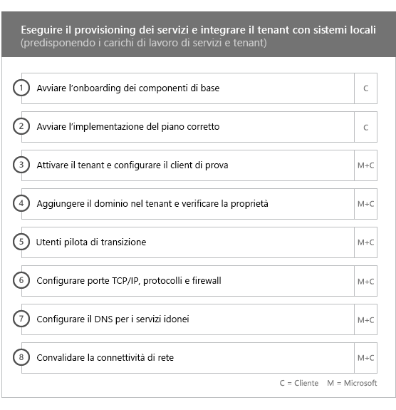
  
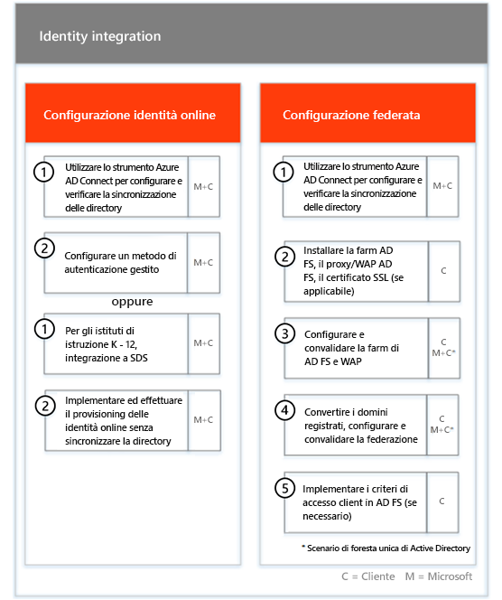
  
> [!NOTE]
> WAP è l'acronimo di Web Application Proxy. SSL è l'acronimo di Secure Sockets Layer. SDS è l'acronimo di School Data Sync. Per ulteriori informazioni su SDS, vedere [Introduzione a Microsoft School Data Sync](https://go.microsoft.com/fwlink/?linkid=871480). 
  
L'onboarding per uno o più servizi può iniziare al termine dell'onboarding di base.
  
## Exchange Online

Per Exchange Online, l'utente viene guidato nell'utilizzo della posta elettronica per l'organizzazione. La procedura esatta dipende dall'ambiente di origine e dai piani di migrazione della posta elettronica. Può includere materiale sussidiario per:
  
- Configurare le funzionalità di Exchange Online Protection (EOP) per tutti i domini abilitati alla posta elettronica convalidati in Office 365.   
    > [!NOTE]
    > I record MX (Mail Exchange) devono puntare a Office 365.   
- Configurare la funzionalità Protezione avanzata dalle minacce per Exchange Online (ATP) se rientra nel servizio di sottoscrizione una volta che i record MX puntano a Office 365. Questa funzionalità è configurata come parte delle impostazioni antimalware di Exchange Online Protection.   
- Configurazione delle porte del firewall.   
- Impostare DNS, incluso il servizio obbligatorio di Autodiscover, SPF (Sender Policy Framework) e i record MX, se necessario.     
- Configurare il flusso di posta elettronica tra l'ambiente di messaggistica di origine e Exchange Online (in base alle esigenze).   
- Eseguire la migrazione della posta dall'ambiente di messaggistica di origine a Office 365.   
    > [!NOTE]
    > Per ulteriori informazioni sulla migrazione della posta e dei dati, vedere [Migrazione dei dati](O365-data-migration.md). 
  
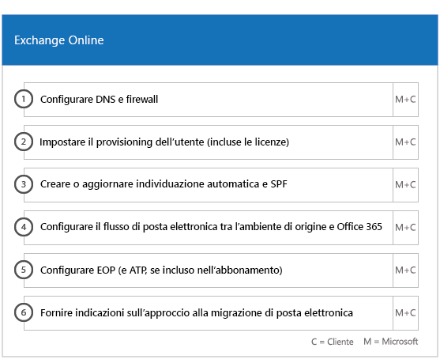
  
## SharePoint Online e OneDrive for Business

Per SharePoint Online e OneDrive for Business, viene fornito materiale sussidiario per: 
- Configurazione DNS.   
- Configurazione delle porte del firewall.   
- Provisioning di utenti e licenze.   
- Configurazione delle funzionalità dell'ambiente ibrido di SharePoint, come la ricerca ibrida, i siti ibridi, la tassonomia ibrida, i tipi di contenuto, la creazione siti in modalità self-service ibrida (solo SharePoint Server 2013), l'icona di avvio delle app estesa, OneDrive for Business ibrido e i siti extranet.
    
Gli esperti di FastTrack forniscono una guida sulla procedura di migrazione di dati a Office 365 mediante una combinazione di strumenti e documentazione nonché eseguendo le attività di configurazione se applicabili e possibili.
  
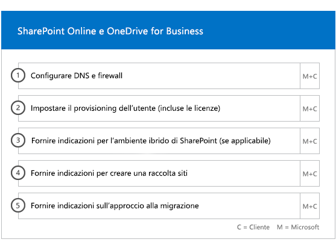
  
## OneDrive for Business

Per OneDrive for Business, la procedura dipende dal corrente utilizzo o meno di SharePoint e, in caso affermativo, dalla versione utilizzata.  
  
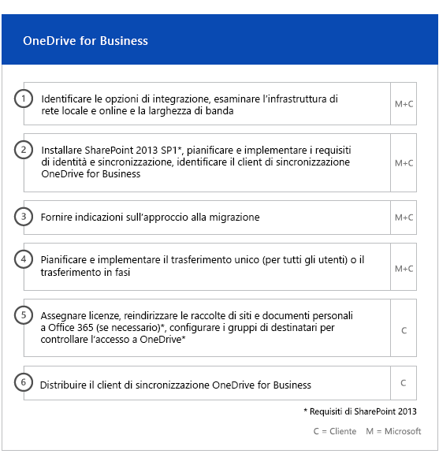
  
## Skype for Business online

Per Skype for Business Online, viene fornito materiale sussidiario per: 
- Configurazione delle porte del firewall.    
- Configurazione DNS.    
- Creare account per qualsiasi dispositivo del sistema chat room.    
- Distribuire un client Skype for Business online supportato.   
- Stabilire la configurazione del server di dominio diviso tra l'ambiente Lync 2010, Lync 2013 o Skype for 2015 Business Server locale e il tenant di Skype for business online (se applicabile).
- Abilitazione dei piani di chiamata, Skype meeting broadcast e sistema telefonico e piani di chiamata (nei mercati disponibili – non disponibile nei piani GCC High o DoD). 
    
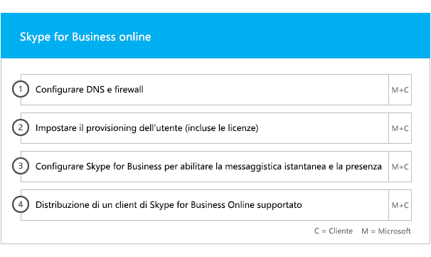
  
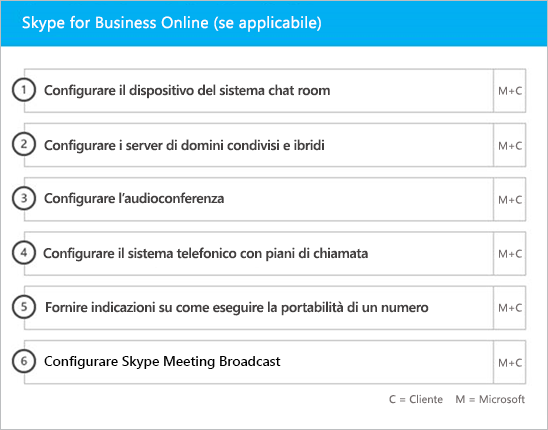
  
## Microsoft Teams

> [!NOTE]
> Il seguente non è disponibile nei piani GCC High o DoD.

Per Microsoft StaffHub viene fornito materiale sussidiario per: 
- Conferma dei requisiti minimi.   
- Configurazione delle porte del firewall.   
- Configurazione DNS.  
- Conferma dell'abilitazione di Microsoft Teams sul tenant Office 365.    
- Abilitazione o disabilitazione delle licenze utente.
    
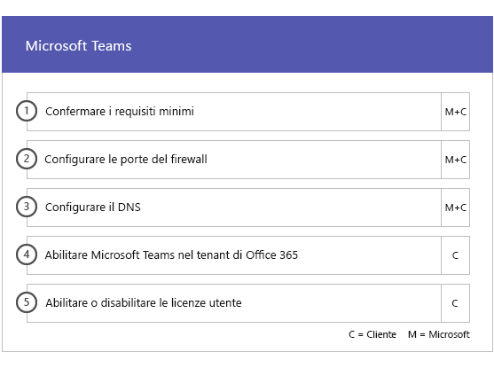
  
## Power BI

Per Power BI, viene fornito materiale sussidiario per:  
- Assegnare licenze di Power BI.    
- Distribuire l'app Power BI Desktop.   
## Project Online

Per Project Online, viene fornito materiale sussidiario per: 
- Verificare la funzionalità di base di SharePoint sulla quale fa affidamento Project Online.    
- Aggiungere il servizio Project Online al tenant (inclusa l'aggiunta di sottoscrizioni per gli utenti).    
- Configurare il pool di risorse organizzazione (ERP).   
- Creare il primo progetto. 
    
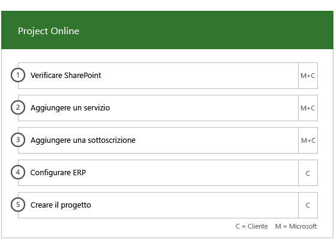
  
## Yammer Enterprise

Per Yammer, viene fornito materiale sussidiario per l'attivazione del servizio Yammer Enterprise.

> [!NOTE]
> Yammer Enterprise non è un componente di Office 365 US Government, ma può essere acquisito gratuitamente come offerta autonoma per ogni utente concesso in licenza per Office 365 in GCC. Questa offerta è attualmente limitata ai clienti che acquistano Office 365 GCC in contratti Enterprise e contratti di sottoscrizione Enterprise. Yammer non è disponibile nei piani GCC High o DoD. 
  
## Microsoft 365 Apps

Nel caso di Microsoft 365 Apps, viene fornita una guida per gli aspetti seguenti: 
- Risoluzione dei problemi di implementazione.    
- Assegnare i contratti di licenza con l'utente finale utilizzando l'[interfaccia di amministrazione di Microsoft 365](https://go.microsoft.com/fwlink/?linkid=2032704) e Windows PowerShell.    
- Installare Microsoft 365 Apps dal portale di Office 365 tramite la tecnologia A portata di clic.    
- Installazione delle app di Office Mobile (ad esempio Outlook Mobile, Word Mobile, Excel Mobile e PowerPoint Mobile) sui dispositivi iOS o Android.   
- Configurare le impostazioni di aggiornamento con lo strumento di distribuzione di Office 365.    
- Configurazione di un solo server di distribuzione nel sito per le app Microsoft 365, inclusa l'assistenza per la creazione di un file di configuration.xml da utilizzare con lo strumento di distribuzione di Office 365.    
- Distribuzione con Microsoft Endpoint Configuration Manager, che include una guida per la creazione del pacchetto di Microsoft Endpoint Configuration Manager.
    
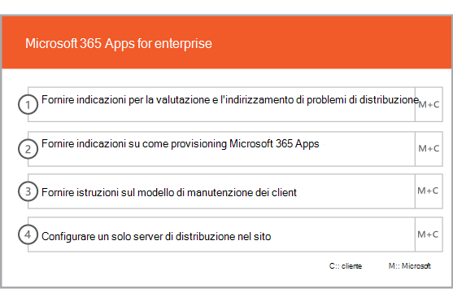
